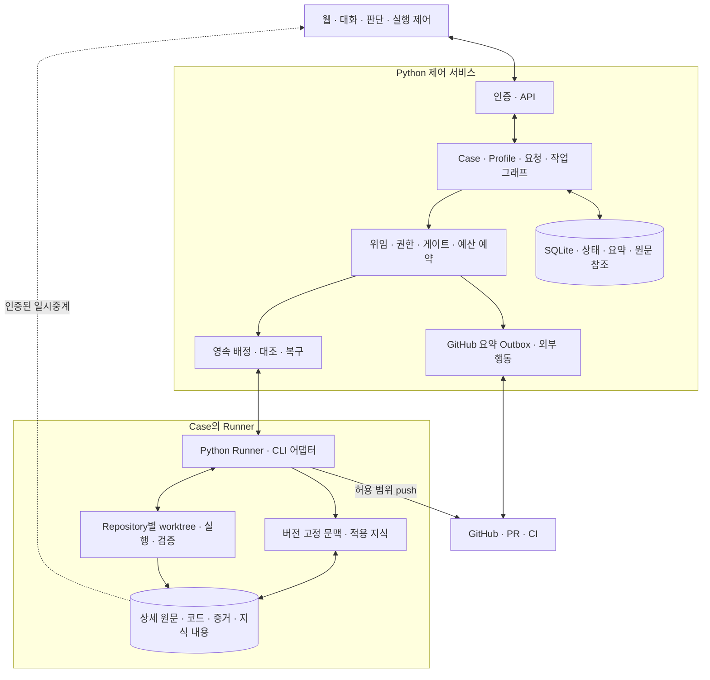

# 사람–AI SW 개발 협업 시스템 — 설계 기준안 v0.7

개정일: 2026-09-21. 사용자 결정 D-01~67과 이번 대화의 확정 정책을 반영한다. 제품 정책·상세 설계 제안·구현 사실은 구분한다. **제품 구현은 v0.6 기준 P3-03까지이며 v0.7 적용은 후속 작업**이다. 현재 상태와 다음 작업은 [DEVELOPMENT.md](DEVELOPMENT.md), 변경 근거는 [decisions.md](decisions.md)를 따른다.

## 목표와 책임

위험·불확실성·비용에 따라 필요한 통제를 선택하고, 사람은 AI에 위임하지 않은 판단에서만 호출한다. AI는 조사·설계·계획·구현·실험·검증을 동적 작업 그래프로 구성한다. 시스템은 요청·결정·범위·권한·버전·검증·자원을 지속적으로 검사하고 세션 밖에 근거를 보존한다.

사람에게 필요한 것은 제품/UX의 실제 선택, 권한 확대나 비가역 외부 행동, 증거로 해소하지 못한 중요한 모호성, 정책 한도 변경과 예외 수용이다. 설계/계획 검토 필요성, 피드백 반영 버전, stale 판정, 증거와 기준 연결, 게이트 선택과 결과 후보는 AI와 시스템이 처리한다. 사람의 열람·피드백·판단 가능성은 항상 열어 두되 모든 절차에 대기를 만들지 않는다.

## 첫 버전 범위

| 영역 | 제공 범위 | 범위 밖·이후 확장 |
|---|---|---|
| 사용자·Project | 한 사용자, 여러 독립 Project, Project별 복수 Repository | 공동 사용 UI·역할 관리, 여러 Project를 묶는 Case |
| 작업 배치 | Case가 선택한 여러 Repository를 같은 Runner에서 처리 | 한 Case를 여러 Runner에 분산 실행 |
| 업무 | feature / defect-fix / root-cause-analysis / research / refactoring / maintenance | 실제 경험 없이 세부 Profile을 계속 분리하지 않음 |
| 자동화 | WorkDepth와 Autonomy 분리, Fast Lane, material-delta 질문, 기본 무제한·선택적 예산 제한 | 실행 능력 없이 절대 비용 상한을 약속하지 않음 |
| GitHub | 지정 기록 저장소의 Case별 이슈·요약, PR 리뷰·CI 읽기, 허용 범위 push·PR 생성/수정 | GitLab, 강제 push·병합·이슈 종료·CI 수동 재실행·배포 |
| 지식 | 원본·적용 조건 관리, 선택적 추출, 범위·활동에 맞는 자동 주입 | 범용 검색 체계·외부 지식 저장소는 이 시스템의 구성 요소/의존 조건이 아님 |
| 설치·배포 | Windows 네이티브, 일반 사용자 프로세스, 로컬/서버 완결형 및 서버+PC Runner | Linux/WSL, 런타임 포함 설치 프로그램, Windows 서비스, 인터넷 직접 공개 |
| 접점·CLI | 웹 UI, Codex·Claude Code·OpenCode 어댑터 계약과 능력별 지원 | IDE·외부 CLI에 지식 제공하는 접점, 별도 모델 API 실행기 |

Python/FastAPI 제어부·독립 Python Runner·SQLite·React/TypeScript 웹 UI를 채택한다. 관리 대상 프로젝트 언어는 제한하지 않는다. OpenCode의 문서 계약과 설치·실증 여부, 각 CLI의 실제 지원 능력은 별도로 표시한다. 신뢰하는 개인 프로젝트를 대상으로 하며 worktree나 CLI 설정을 PC 전체 OS 격리라고 설명하지 않는다.

## 의도·작업 깊이·자동화

| 축 | 의미와 기본값 |
|---|---|
| WorkDepth | simple / standard / deep. 분석·설계·검증의 상세도이며 승인 횟수가 아님 |
| Autonomy | 기본 ask-on-decision. controlled는 시작·결과 확인, 설계/계획 사람 검토는 별도 선택 |
| Budget | 기본 무제한. 필요 지표의 경고·hard 한도를 설정. repair 제한과 독립 |
| Case Profile | 목적별 intent·산출물·증거·완료 의미의 기본 계약. 고정 workflow가 아님 |

AI가 Profile에 맞는 intake 초안을 만들고 원래 요청·관찰·제안·가정·미정을 구별한다. feature의 사용자/행동, defect의 관찰/기대 동작, RCA의 설명할 현상/확신 수준, research의 질문/평가 기준, refactoring의 개선/보존 계약, maintenance의 대상/목표 상태를 각각 중심에 둔다. 공통 여섯 항목에 모든 Profile 필드를 겹치는 고정 양식으로 만들지 않는다.

초안을 보여줄 준비와 특정 작업을 실행할 준비는 다르다. AI가 조사할 사실은 스스로 조사하고, 위임하지 않은 선택은 질문하고, 나중 기술 판단은 의존 작업에 연결한다. 피드백은 해당 항목에 적용하며 한 질문의 답변을 초안 전체 동의로 만들지 않는다. 분류가 불확실하다는 이유만으로 사용자에게 Profile을 선택시키지 않는다. 상세는 [Case Profile](case-profiles.md), [intake·산출물](intent-artifacts.md).

Fast Lane은 `요청 → 정규화·가벼운 확인 → 필요한 계획/구현/검증 → 결과`다. 요청·범위·기준·제약·검증 방법과 결과는 기록하지만 별도 설계/계획 문서·세션·승인을 강제하지 않는다. QG-01의 요청 정합성은 유지하고 독립 의미 검토는 불확실성·영향·정책상 필요할 때만 수행한다. 선택된 독립 검토는 작성과 별도 세션이며 같은 모델을 쓸 수 있다. 자체 점검을 독립 검토 통과로 기록하지 않는다.

실행 위임의 기준은 최초 요청과 유효한 후속 사용자 결정·Project 정책이다. material delta는 이전 AI 초안이 아니라 이 기준과 누적 변경을 비교한다. 목표/범위 추가·제외, 새로운 제품 선택, 보안·권한·데이터 영향, 중요한 성공 기준 변경을 재판단한다. 허용된 저장소 추가·기술 선택·심층 분석은 자동 진행할 수 있고 Fast Lane 이탈만으로 controlled로 바꾸지 않는다. 자동 정규화에는 사람 승인 기록을 만들지 않는다.

## 정책과 진행 조건

권한·명시적 금지는 Profile·작업 깊이·자동화가 확대할 수 없다. 목표와 필수 성공 기준은 예산이나 게이트 설정으로 완화할 수 없다. Project 기본값과 Case/Task 선택의 출처를 보존하되, 기본값 재정의와 강제 경계 변경을 구분한다. Profile은 사용자의 구체 요청을 덮어쓰지 않는다. 실행·검토별 입력과 정책 버전을 고정한다.

```text
필요한 원문·기준·지식의 버전과 적용 조건 확인
AND 현재 요청 위임 및 해당 Autonomy 체크포인트 충족
AND 필요한 사람 결정·의존 Task·적용 게이트 조건 충족
AND 해당 저장소·행동의 실행/외부 반영 권한 유효
AND 같은 Case의 Runner·작업공간·CLI 능력 사용 가능
AND 중복 쓰기·결과 불명 실행 없음
AND 설정된 Case 예산의 예약/실행 조건 충족
```

질문·검증 실패·지식 충돌은 의존 작업을 보류하며 독립 작업은 계속할 수 있다. 영향 범위를 확인할 수 없으면 불명 상태를 감추거나 독립이라고 추측하지 않는다. 게이트 변경은 진행 중 검증 1회를 원래 정책으로 마친 뒤 예약 적용한다. 권한 철회·중지 요청은 새 관련 행동을 차단하고 지원되는 안전 경계에서 멈추며 이미 발생한 외부 효과를 되돌렸다고 가정하지 않는다. 늦은 결과는 원래 버전에 귀속시키고 채택 시 현재 유효성을 재평가한다.

총예산 기본 무제한과 품질 실패 후 기본 최대 2회 repair는 별개다. 설정 예산은 모든 역할·재시도·선택적 지식 추출을 합산하고 병렬 배정 전 예약한다. 세션/Task 분할로 초기화하지 않는다. 정확값·추정값·미제공을 구별하며 CLI 내부 호출/문맥을 모두 관측한다고 가정하지 않는다. hard 한도에서 새 비용 발생 실행을 막고 기존 결과·효과를 대조한다. 모델 절약이나 예산 소진이 검증 면제가 될 수 없다. 상세는 [자동화·예산 정책](autonomy-budget-policy.md).

## 목적별 결과와 완료

| 업무 | 완료 의미의 핵심 |
|---|---|
| feature | 약속한 동작·관련 제약·회귀 확인 |
| defect-fix | 근거 있는 기대 동작 복원. 미재현만으로 해결 판정 금지 |
| root-cause-analysis | 합의한 설명/인과 확신 수준과 근거. 원인 확정이 목표라면 불확실 결론은 목표 충족이 아님 |
| research | 합의한 조사·비교·실험과 근거·한계. 완료조건에 따라 판단 불가 보고도 가능 |
| refactoring | 개선 목적과 보존할 동작/계약 모두 증명 |
| maintenance | 특정 대상의 목표 상태와 호환성·운영 조건 확인 |

혼합 목적은 대표 Profile 하나로 다른 의무를 지우지 않는다. 충분한 현재 증거로 이미 목표를 충족했다면 불필요한 수정 없이 완료할 수 있다. 변경량·CLI 정상 종료·테스트 몇 개 통과만으로 목표 충족을 주장하지 않는다. 로컬 실험은 기존 권한·예산·테스트 데이터 안에서 자동 수행하되 RCA 요청을 제품 수정 요청으로 확대하지 않는다.

기본 ask-on-decision은 필요한 조건이 모두 충족되면 자동 완료한다. controlled는 `시작 확인 → 작업·로컬 검증 → 결과 후보 확인 → 허용 push·PR → 필요한 외부 CI → 시스템 종료`다. 결과 확인 당시 외부 검증 대기를 보여준다. CI 수정으로 확인한 diff/본문 등이 바뀌면 재확인하고 같은 내용 재전송은 반복 확인하지 않는다. 게시 권한이 있다는 이유만으로 게시가 완료조건이 되지는 않는다.

품질 판정·사람 확인·실행 권한·외부 전달·완료는 각각 관리한다. 미충족/미검증의 예외 종료는 사람이 명시 수용하고 원판정은 보존한다. 종료 후 수정은 연결된 새 Case이며 단순 설명 질문은 새 수정 업무가 아니다. 상세는 [완료 계약](completion-lifecycle.md).

## 논리 아키텍처와 모델



제어부는 별도 대형 workflow 서버 없이 모듈형 단일 서비스로 시작한다. Runner는 API로 상태·요약을 보고하고 서버 SQLite 파일을 직접 공유하지 않는다. 원문을 필요로 하는 계획·검토도 접근 가능한 Runner에서 수행한다.

`Project → Case → Task → Run`과 별도로 `Project → Repository`, `Case × Repository → Workspace`를 둔다. Case는 하나의 사용자 목표 묶음이고 Task는 실제 활동, Run은 실행 시도다. Case와 CLI 세션은 1:1이 아니다. AI가 상황에 따라 Task를 추가·분할·대체하되 필수 기준·이력·예산을 보존한다.

| 책임 | 주요 기록·계약 |
|---|---|
| 요청·업무 | Profile/version, 요청 근거, Intent revision, Feedback/OpenQuestion/Decision, SuccessCriterion |
| 실행 | WorkGraphRevision, Task, Run, Repository snapshot vector, Workspace, Lease/Checkpoint/Event |
| 정책 | 유효 위임, WorkDepth/Autonomy, GatePolicy, Budget reservation/usage, pending change, scoped Grant |
| 검토·완료 | Evaluation/Finding/RepairCycle, CompletionCandidate, Result confirmation, Exception/Closure |
| 원문·지식 | ArtifactRevision/Location, ContextManifest, Knowledge revision/source/applicability/status |
| 외부·운영 | Project 기록 저장소, Case-PR binding, ExternalAction, Outbox/DeliveryAttempt, BackupManifest |

명칭은 책임 경계이며 고정 DB 필드명이 아니다. API와 영속 상태는 요청 재전송·오래된 버전 충돌을 검사하며 원격 GitHub와 로컬 DB를 하나의 원자 트랜잭션으로 가정하지 않는다.

## 복수 저장소와 외부 반영

Project의 등록 저장소, 쓰기/게시 허용 집합, Case의 선택 집합을 구분한다. 원래 목표·명시 제외·제품/데이터 영향을 유지하면 허용 집합 안의 저장소를 자동 추가한다. 코드 쓰기 허용만으로 게시를 허용하지 않는다. 같은 Runner에 Repository별 작업공간·기준 버전·변경 스냅샷을 준비하고 사용자 dirty tree를 보존한다. 통합 근거는 실제 시험한 저장소 조합과 환경에 연결한다.

기본 동일 Runner 쓰기 1개와 공유 자원 잠금을 유지한다. 별도 worktree가 같은 원격 ref/PR 충돌을 해결하지 않으므로 외부 수정도 조정한다. 일부 저장소만 성공하면 부분 결과를 표시하고 필요한 전체 조합 확인 전 완료하지 않는다. 결과 불명은 대조 후, 알려진 실패만 재시도하며 이미 성공한 효과를 일괄 삭제하지 않는다. 상대 저장소 반영 대기와 실제 코드 결함을 구별한다.

GitHub 기록은 Project 지정 저장소에 Case당 새 이슈 하나다. 기존 이슈는 출처, PR 리뷰는 피드백이며 일반 이슈 댓글은 실행 명령·승인이 아니다. 기록은 `[AI 협업 시스템 기록]` 표식과 요약·참조를 append하고 코드·diff·상세 로그를 자동 게시하지 않는다. 기록 저장소를 코드 변경 대상으로 자동 포함하지 않는다.

Case 시작의 범위 허용으로 push·PR을 자동 수행하되 정확한 대상·ref·SHA·내용·영향·권한 유효성을 직전 검사한다. controlled의 결과 확인은 별도 유지한다. 게시 장애는 내부 작업과 구분하고 고정 payload·시도·외부 결과를 보존한다. 상세는 [실행·작업공간](execution-workspace-review.md), [GitHub 기록](github-journal.md).

## 지식·문맥·저장 경계

프로젝트 지식은 다른 작업의 판단에 다시 필요한 결정 이유·제약·문제/진단·운영 사실을 대상으로 한다. 원본과 짧은 적용 내용·범위·조건·근거·버전·필수/참고·유효 상태를 연결한다. 확정 규칙을 옮길 때 재승인하지 않고 새로운 AI 일반화는 참고 후보로 둔다. 지식 분류만으로 강제성을 만들거나 코드 불일치만으로 규칙을 철회하지 않는다.

의미 있는 발견에서 기존 작업 결과와 함께 후보를 추출한다. 모든 Case의 추출 호출·문서·채택 승인을 강제하지 않는다. 중복은 근거 추가, 변경은 버전 대체로 보존한다. 작업 시작·범위 확대·관련 지식 변화에 적용을 재평가한다. 설계에는 ADR만, 구현에는 Constraint만 주는 식으로 고정하지 않는다. 필수 내용의 조건·예외를 직접 제공하고 참고는 짧은 설명·원본 접근 경로를 준다. 필수 내용 누락/충돌은 의존 작업을 보류하며 주입 기록과 준수 검증은 별개다. 상세는 [프로젝트 지식](project-knowledge.md).

서버+PC 구성에서는 제어부가 상태·요약·ID/버전/해시/참조만 보관하고 상세 문서·대화·검토 입력/출력·코드·증거·지식 내용은 원문 소유 Runner에 둔다. 지식 기능을 이유로 원문을 서버에 자동 복제하지 않는다. 한 Case의 실행 Runner가 과거 모든 지식의 원문 소유자라는 뜻도 아니다. 참조 불가와 미적용은 다르게 기록한다.

상세 조회는 인증된 일시중계이며 DB·로그·큐·캐시에 원문을 영구 저장하지 않는다. PC에 저장하지 못한 입력은 완료 응답하지 않는다. 원본은 제어 상태와 Runner 원문을 함께 뜻하며 GitHub 요약·CLI 세션이 이를 대체하지 않는다. ContextManifest는 실제 입력·참조·지식 버전/이유/필수 제공 실패를 기록한다. 긴 문맥은 필수 기준을 보존하며 분할한다. 컨텍스트 제공만으로 AI의 이해·준수를 보장하지 않는다.

## 운영·구현과 검증

어댑터는 설치/버전, 세션, 구조화 결과, 권한, 도구 경계 관찰·차단, 사용량 등을 능력별 보고한다. 문서상 가능·구현됨·실증됨·미지원을 구분한다. 프로세스 종료를 안전한 도구 경계 중지로 표시하지 않는다. 단절/lease 만료만으로 같은 쓰기를 다른 Runner에 배정하지 않고 재연결 후 실제 상태·효과를 대조한다.

역할별 모델은 기존 허용 설정 안에서 선택한다. 사전 허용되지 않은 다른 CLI로 장애 대체하기 전 확인한다. 외부 AI 전송은 기존 CLI 설정을 따르며 로그인 정보는 Runner에 유지한다. 로컬 실행을 오프라인 AI 처리라고 표시하지 않는다.

초기 수용 규모는 10 Project·3 Runner·동시 AI 2개이며 등록 상한이나 실측 보장이 아니다. 호스트별 하루 한 번 백업·최근 7개 유지·원본 자동 삭제 금지, PC 원문 서버 복제 금지, LAN/사용자 VPN 인증·암호화를 유지한다. 운영 상세는 [구현 기준](implementation-baseline.md).

P1~P3-03의 완료 근거는 보존한다. 다음은 **P3-R1 정책·Profile·마이그레이션 → P3-R2 복수 저장소 → P3-R3 예산 → P3-R4 자동 실행 경로 → P3-04 통합 시나리오**다. P4에서 전체 게이트·여섯 업무·지식 관리/추출/주입을 완성하고 P5 외부 반영, P6 원격·운영 수용으로 이어간다. 현재 완료와 새 목표를 섞지 않으며 상세 순서·plan·검증·인계는 [DEVELOPMENT.md](DEVELOPMENT.md)가 정본이다.

## 상세 문서

- [사용자 결정](decisions.md), [검토 이력](review-status.md), [설계 검토 결과](design-review-report.md)
- [자동화·예산](autonomy-budget-policy.md), [Case Profile](case-profiles.md), [프로젝트 지식](project-knowledge.md)
- [기능 요구](scenarios-functional-requirements.md), [비기능 요구](nonfunctional-requirements.md), [수용 시나리오](review-acceptance-matrix.md)
- [의도·산출물](intent-artifacts.md), [깊이·UX](sizing-and-review-ux.md), [품질 게이트](quality-gates.md), [게이트 운영](gate-operations.md)
- [검토 문맥](review-context-contract.md), [완료](completion-lifecycle.md), [실행 공간](execution-workspace-review.md), [GitHub](github-journal.md), [데이터 경계](data-boundary-review.md)
- [운영 기준](implementation-baseline.md), [기술 조사 기록](review-tech-findings.md), [CLI 중지 조사](cli-pause-feasibility.md)
