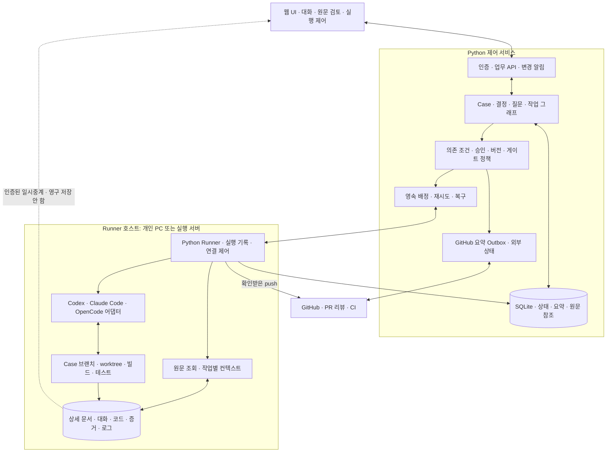

# 사람–AI SW 개발 협업 시스템 — 설계 기준안 v0.6

작성일: 2026-09-20. 제품 정책에 대한 사용자 결정과 이를 구현할 상세 설계 제안을 구분한다. 이 문서는 구현 완료·CLI 호환성 시험·성능 시험 결과가 아니다.

## 목표와 설계 방향

사람은 개발 문제를 제기하고 의도·제품 판단·피드백을 제공한다. AI는 요청에 필요한 조사·설계·계획·구현·실험·검증 작업을 구성하고 실행한다. 시스템은 무엇에 합의했는지, 어떤 근거로 진행·완료할 수 있는지를 세션 밖에 보존한다.

핵심은 **기능 개발에서 사람의 의도를 먼저 확인하고, 최신 의도에 대한 명시적 동의와 필요한 설계·계획을 갖춘 뒤 구현하는 것**이다. 기능 개발·버그 수정·원인 분석·연구를 하나의 고정 단계에 끼워 넣지는 않는다. AI가 작업 그래프를 제안하고, 프로그램이 버전·의존 관계·정책·승인·완료 조건을 검사하는 구조를 채택한다.

첫 구현은 **Python/FastAPI 제어 서비스 + 독립 Python Runner + 코딩 CLI 어댑터 + SQLite + React/TypeScript 웹 UI**다. 제어 서비스는 내부 책임을 나눈 단일 프로그램으로 시작한다. 별도 대형 워크플로 서버나 PostgreSQL은 확장 시 검토한다. AI의 자연어 계획을 그대로 실행 권한으로 사용하지 않는다.

## 첫 버전 범위

| 영역 | 제공 범위 | 이후 확장 |
|---|---|---|
| 사용자·프로젝트 | 한 사용자, 여러 독립 프로젝트. 프로젝트당 Git 저장소 하나 | 실제 공동 사용·역할 관리, 프로젝트 내부 복수 저장소, 여러 프로젝트를 묶는 업무 |
| 설치 | Windows 네이티브. Python·Git 준비 후 설치/실행 스크립트, 일반 사용자 프로세스. 빌드된 웹 UI 포함 | Linux/WSL, 런타임 포함 설치 프로그램, Windows 서비스 |
| 배포 | 로컬 완결형, 서버 완결형, 서버 제어부 + 개인 PC Runner | 운영 규모에 따른 제어부·저장소 확장 |
| AI 실행 | 설치된 Codex·Claude Code·OpenCode 연결. 프로젝트 기본 CLI·모델과 업무·역할별 조정 | 별도 모델 API 실행기 등 |
| GitHub | 이슈 출처 읽기, 업무별 새 기록 이슈·요약 댓글, PR 리뷰 피드백, CI 상태·근거 조회, 확인받은 push·PR 생성·수정 | GitLab, 병합·이슈 종료·CI 수동 재실행·배포 |
| 지식 | 결정·출처·근거·적용 범위 보존 | 지식 후보 추출·채택 화면·자동 재사용, QG-08 |
| 접점 | 웹에서 대화·산출물 검토·승인·실행 제어 | IDE·CLI 접점 |

OpenCode는 사용자 설명상 미설치다. 공식 문서에 따라 어댑터를 구현하는 범위와 실제 설치 환경에서의 검증을 분리하고 후자는 미검증으로 표시한다. 설치된 CLI도 별도 시험 없이 호환성을 확정하지 않는다. 관리 대상 프로젝트의 언어는 제한하지 않으며 빌드·테스트·실험 명령을 프로젝트 설정으로 연결한다.

Windows에서는 신뢰하는 개인 프로젝트를 대상으로 시작한다. CLI 권한 설정과 시스템 승인으로 통제하며 OS 수준의 완전 격리는 보장하지 않는다. worktree는 변경 파일의 분리 수단이다. 실행 기능과 무관한 PC 전체 권한 격리를 확보했다고 설명하지 않는다.

## 의도·검토·검증의 관계

기능 개발의 의도 초안은 목표, 기대 결과, 범위, 제외사항, 제약, 미정 질문을 포함한다. 원래 요청·가정·성공 기준·피드백과 연결하고, 사람이 검토한 최신 원문에 대한 명시적 동의를 기록한다. 작은 기능이나 자세한 최초 요청도 이 과정을 생략하지 않는다. 유효한 동일 동의를 반복 요구하지 않는다.

의도 단계에 필요한 사람 결정은 반드시 받는다. 설계·계획에서 다루는 것이 적절한 질문은 그 단계와 영향을 받는 작업을 표시하고 넘길 수 있다. 해당 질문에 의존하는 작업 전에 필요한 결정을 받아야 하며, 단계의 자동 진행 옵션이 사람 판단을 대신하지 않는다. 미정 질문을 잘 드러낸 초안은 검토할 수 있지만, 초안의 품질 통과와 구현 준비 완료는 다르다.

| 조건 | 기본 정책 | 생략·변경 시에도 유지되는 것 |
|---|---|---|
| 최신 기능 의도 동의 | 사람의 명시적 동의 필수 | AI 검토·실험 허용·다른 단계 승인으로 대체하지 않음 |
| 의도 품질 게이트 QG-01 | 기능 개발에 필수, OFF 불가 | 사람 동의와 별도 |
| 설계·개발계획 | 필요한 수준으로 구현 전에 작성 | 사람 검토를 자동으로 바꿔도 산출물은 보존 |
| 설계·계획의 사람 검토 | 프로젝트 기본값은 둘 다 사람 검토, 업무별 각각 자동 선택 가능 | 의도 동의·실행 권한·품질 게이트는 독립 |
| 나머지 품질 게이트 | 규모·위험에 따른 제안, Case별 ON/OFF와 필요한 Task별 조정 | OFF는 통과가 아니며 성공 기준·검증 작업을 없애지 않음 |
| AI 의미 검토 | 작성과 별도 세션 | 같은 CLI·모델 사용 가능. 실제 테스트·규칙 검사와 구별 |
| 품질 실패 후 수정 | 최초 실패 후 기본 최대 2회 수정·재검증, Case별 조정 | 제품 판단이 필요하면 즉시 질문. 세션 교체로 횟수 초기화 금지 |
| 실행 중 게이트 설정 변경 | 현재 검증 1회 종료 후 예약 적용 | 현재 판정 보존, 이후 수정·재검증부터 새 설정 사용 |
| 최종 완료 | 기본은 사람 확인, Case별 자동 완료 선택 가능 | 실패·미검증을 AI가 예외 수용하지 않음 |
| 예외 수용 종료 | 사람이 남은 문제·미검증 범위와 영향을 확인해 명시적으로 수용 | 원래 판정 보존. 추가 실행·외부 반영 권한을 만들지 않음 |

작업 수준은 간소·표준·심층이다. AI가 변경 규모·영향·불확실성의 근거로 제안하고 사람이 조정한다. 간소는 짧은 변경안·계획, 표준은 설계·개발계획, 심층은 대안·위험·통합 검증을 상세화한다. 문서 깊이, 사람 검토, 품질 게이트, 성공 기준의 검증을 각각 설정한다.

## 주요 유저 시나리오

| 상황 | 업무 흐름 | 종료 판단 |
|---|---|---|
| 작은 기능 | 코드 읽기 → 의도 초안·피드백·최신 동의 → 간소 변경안·계획과 적용 검토 → 구현·검증 | 합의한 기준과 필요한 확인 충족 |
| 중대 기능 | 의도 합의 → 설계·개발계획 → 여러 구현·통합 작업 → 기준별 검증 | 부분 작업의 성공을 전체 완료로 확대하지 않음 |
| 명확한 버그 수정 | 요청의 목표·범위·종료조건을 표시하고 진행 → 재현·수정·회귀 검증 | 기존 기대 동작의 복원 증거. 새 제품 동작이 필요하면 기능 의도 검토 |
| 복잡한 원인 분석 | 읽기 조사 → 미허용 실험 범위 확인 → 가설·재현·계측·반증 반복 | 원인·수정의 근거와 남은 불확실성을 구분 |
| 연구 | 질문·범위·종료조건 정리 → 필요한 실험 허용 → 조사·비교·실험 → 근거·한계 | 합의한 조사 조건을 충족했다면 판단 불가 결론도 정상 완료 가능 |
| 진행 중 피드백 | 질문은 답변, 수정은 영향 분석, 중요한 의도 변경은 새 원문 합의 | 변경에 영향받는 승인·검증만 재평가 |
| 완료 후 수정 | 이전 업무를 연결하는 새 Case와 새 기록 이슈 생성 | 기존 종료 기록을 재개·덮어쓰기하지 않음 |
| 세션·연결 중단 | 영속 기록과 실제 실행을 대조해 재개 | 기존 실행 불명 상태에서 같은 쓰기를 중복 배정하지 않음 |

기능 개발 이외의 업무는 요청의 목표·범위·종료조건이 명확하면 시작하고 중요한 미정만 질문한다. 분석·연구에서 재현·계측·임시 실험의 범위가 명시되지 않았다면 읽기 조사 후 그 범위를 한 번 확인받는다. 이미 요청·허용한 같은 활동은 반복 확인하지 않는다. 기능 개발 의도 확정 전에는 읽기·분석만 자동 허용하며 코드 수정·실험에는 별도 확인이 필요하다.

## 논리 아키텍처



화살표 `Runner → DB`는 제어 API를 통한 상태·요약 등록을 뜻한다. 원격 Runner가 SQLite 파일에 직접 접속하지 않는다. 그림의 제어부 모듈은 별도 서버가 아니다. 계획·의미 검토 같은 AI 실행도 원문이 있는 Runner의 CLI에서 수행하며 제어부는 실행 계약과 결과를 검사한다.

| 구성 | 책임 |
|---|---|
| 업무 API·접근 관리 | 단일 소유자 인증, 프로젝트·Runner 연결, 요청 ID와 버전에 구속된 변경. 향후 사용자·프로젝트 권한 확장 경계 |
| Case 서비스 | 원문 참조와 목표·범위·기준 요약, 피드백·가정·질문·결정·현재 상태. 설명 대화와 실행 변경 구분 |
| 계획 조정 | AI가 제안한 작업·의존 관계·추가 조사·재계획을 버전으로 보존. 명칭 변경으로 필수 조건을 우회하지 않도록 실제 변경 내용 검사 |
| 정책 서비스 | 기능 의도, 단계 검토, 게이트, 성공 기준, 권한, 입력 유효성, 자원 한도를 독립 조건으로 평가 |
| 스케줄러 | 실행 가능한 작업의 영속 배정, 동일 Case 및 Runner 쓰기 조정, 대기·취소·재시도·재접속 대조 |
| Runner·어댑터 | 로컬 입력·출력·프로세스·도구 경계 관리, CLI 능력 탐지, 실제 실행과 증거 수집, 원문 저장 |
| 컨텍스트 구성 | 원본·결정·제약·기준과 필요한 파일을 범위별 제공. 필수 입력 누락을 전체 대화 요약으로 대체하지 않음 |
| 검증·완료 평가 | 규칙·실제 테스트·별도 AI 검토 결과를 기준·버전·환경에 연결. 통과·실패·미검증·실행 불가·판단 필요 구분 |
| GitHub 연동 | 새로운 기록 이슈, 요약 append, PR 리뷰 수집, CI 읽기, 정확한 대상·내용을 확인받은 push·PR 반영 |

## 실행 모델과 상태

`Project → Case → Task → Run`으로 구분한다. 한 Case는 사람의 문제 제기 한 건이고 GitHub 기록 이슈 하나를 갖는다. Task는 필요한 조사·설계·구현·실험·검증 단위다. Run은 실행 시도이며 CLI 세션과 입력·정책·작업공간을 연결한다. Case와 CLI 세션은 1:1이 아니다.

작업 그래프는 고정 템플릿이 아니다. 새 근거에 따라 작업을 추가·분할·대체할 수 있으며 실행 중인 결과의 귀속과 변경 이유를 보존한다. 다만 기능 개발에는 의도·해당 설계·계획 선행 조건을 적용하고, 모든 후속 작업은 필요한 사람 결정과 검증 상태를 확인해야 한다.

실행 가능 여부는 다음 조건의 결합으로 계산한다.

```text
필요한 입력과 원문 버전을 확인할 수 있음
AND 실제 업무 유형에 적용되는 의도·단계 검토 조건 충족
AND 의존 작업 및 현재 켜진 게이트의 진행 조건 충족
AND 필요한 사람 결정과 실행·외부 반영 허용이 유효함
AND 원문 소유 Runner·작업공간·필수 CLI 능력이 사용 가능함
AND 중복 쓰기·결과 불명 실행이 없고 적용 자원 한도 내임
```

의도 동의, 품질 판정, 최종 인수, 실행 권한은 별도 기록이다. 종료 코드 0, AI의 ‘완료’ 문장, GitHub 게시 성공은 Case 완료의 충분조건이 아니다. 연구용 임시 코드를 작성한다는 이유만으로 모든 기능 개발 단계를 요구하지 않으며, 허용된 연구 범위와 실제 변경 성격을 검사한다.

Case 진행 상태는 접수·진행·사람 판단 대기·실행 환경 대기·일시 중지·최종 확인 대기·종료·취소로 구분하는 상세안을 둔다. 종료 결과는 기준 충족 완료와 예외 수용 종료를 구분한다. 자동 완료에는 사람의 인수 기록을 만들어 넣지 않는다. GitHub 게시 상태와 Runner 실행 상태는 Case 결과와 별도다.

## 저장·컨텍스트·복구

서버 제어부 + 개인 PC Runner 구성에서는 서버에 상태·요약·버전·해시·원문 참조만 저장한다. 상세 의도·설계·계획·대화, 코드·diff·로그·증거는 PC에 보관한다. 웹의 상세 조회·검토는 PC 연결 시 인증된 일시중계로 제공한다. 중계 본문이 DB·작업 큐·요청 로그·오류 보고·캐시에 자동 저장되지 않도록 시험한다. 서버가 내용을 전혀 취급하지 않는다는 뜻은 아니다.

원문이 필요한 새 입력은 PC 영속 저장과 서버 참조 등록이 모두 확인돼야 저장 완료로 응답한다. PC 오프라인에서는 상태·요약을 읽고 중지 같은 제어 요청을 기록할 수 있지만, 보지 못한 원문에 새 동의나 diff 승인을 부여하지 않는다. 과거 유효한 동의는 오프라인이라는 이유로 취소하지 않는다. 상세 입력은 연결 필요 상태로 두고 서버에 임시 파일로 영속 저장해 우회하지 않는다.

시스템 원본은 제어부의 상태 DB와 Runner 원문 저장소를 함께 뜻한다. GitHub 요약이나 CLI 세션은 이를 대신하지 않는다. 로컬 완결형은 두 역할이 같은 PC에 있고, 서버 완결형은 서버가 Runner 호스트 역할도 하므로 그 호스트에 원문이 존재한다. PC 분리형의 저장 제한을 서버 완결형 자체의 금지로 확대하지 않는다.

긴 업무는 원문·결정·산출물·증거를 영속 보존하고 실행마다 입력 목록을 만든다. 컨텍스트에는 합의한 의도·제약·현재 기준·관련 결정과 필요한 자료를 포함한다. 한 세션에 담기 어려우면 작업·검토를 나누고 전체 기준과 경계를 대조한다. 요약만으로 모든 사실을 복원하거나 컨텍스트 손실을 완전히 제거한다고 약속하지 않는다. 누락·참조 불가가 있으면 필요한 조회·재검토 또는 사람 판단으로 연결한다.

업무별 브랜치·worktree를 만들고 시작 커밋을 기록한다. 사용자의 원래 미커밋 변경을 자동 reset·stash·삭제하지 않는다. 동일 Case 쓰기는 직렬화하고 같은 Runner 쓰기는 기본 1개다. 서버 연결이 끊기면 현재 도구 호출이 끝나는 안전 경계에서 멈춘다. lease 만료는 정지 증거가 아니므로 종료·정지 확인 없이 같은 쓰기를 다른 Runner에 재배정하지 않는다. 재연결 시 실행 ID·이벤트 순서·파일·외부 반영·최신 정책을 대조한다.

## CLI 연결과 외부 반영

프로젝트 기본 CLI·모델을 사용하고 업무·역할별로 조정한다. 다른 CLI로 장애 대체하기 전에는 확인받는다. 검토 세션은 작성과 분리하지만 다른 모델 사용을 필수로 하지는 않는다. 외부 AI 전송에는 첫 버전에서 기존 CLI의 사용자 설정을 따르며 별도 프로젝트 전송 정책은 확장으로 둔다. 로그인 자격증명을 서버의 업무 기록에 복사하지 않는다.

어댑터는 설치·버전·인증 가능 여부, 구조화 출력, 세션 식별·재개, 실행 중 입력, 승인 연결, 도구 경계 관찰·다음 호출 차단, 사용량 보고를 개별 능력으로 기록한다. 문서상 지원·구현됨·실제 검증됨·미지원 상태를 구분한다. `interrupt`나 프로세스 종료만으로 ‘현재 도구 호출 종료 후 안전 중지’를 보장했다고 표시하지 않는다. 요구 능력이 확인되지 않은 모드는 그 기능의 지원을 보류하고 검증 결과와 대안을 사용자에게 제시한다.

GitHub는 업무마다 새 기록용 이슈를 만들며 기존 이슈는 출처로 연결한다. 본문·댓글 상단에 `[AI 협업 시스템 기록]`을 두고 의도·설계·계획·검증의 **요약과 참조**를 누적한다. 코드·diff·상세 로그는 제외한다. 기존 게시물을 수정·삭제해 최신 상태로 맞추지 않는다. append는 시스템의 동작 규칙이며 외부 사용자의 편집까지 불가능하게 만드는 기능은 아니다.

업무 시작 시 허용한 대상·범위 안의 요약 게시는 반복 승인 없이 진행한다. 내부 원본과 게시용 요약을 연결하고 고정된 요약 payload를 영속 Outbox에 둔다. 게시 장애 중에도 내부 작업은 계속한다. 응답 유실은 기존 결과를 대조하고 재시도하며 누적 실패를 알린다. 이슈 댓글은 실행·승인 입력으로 해석하지 않는다. PR 리뷰만 피드백으로 수집하고 최신 코드·범위와 대조한다.

코드 push와 PR 생성·수정은 실제 저장소·대상 ref·커밋 SHA·PR 내용 등을 준비해 확인받은 뒤 실행한다. 승인 후 내용이 바뀌면 이전 확인을 재사용하지 않는다. 강제 push나 다른 PR로의 반영을 묵시적으로 포함하지 않는다. 완료 후 리뷰 수정은 새 Case이며 반영할 PR 대상도 새 업무의 실제 변경 확인에 포함한다. CI는 상태·검사 결과·접근 가능한 실패 근거를 읽고 출처와 코드 버전을 연결한다. 외부 CI 링크만 있는 경우 조회 가능한 범위를 표시하며 모든 공급자 로그 수집을 보장하지 않는다.

## 데이터 모델과 인터페이스 초안

| 묶음 | 핵심 기록 |
|---|---|
| 주체·환경 | Owner, Project, Repository, Runner, RunnerCapability, CredentialReference |
| 업무와 의도 | Case, CaseRelation, Objective/IntentBrief, FeedbackRecord, OpenQuestion, Decision, SuccessCriterion |
| 산출물 | ArtifactRevision, ArtifactLocation, ContextManifest, EvidenceReference, SummaryProjection |
| 제어 | WorkGraphRevision, Task, Run, ExecutionLease, Checkpoint, RunEvent, PendingPolicyChange |
| 검토·권한 | ReviewPolicy, GatePolicy/Override, Evaluation, Finding, RepairCycle, Approval/Grant |
| 완료 | CompletionCandidate, FinalAcceptance, ExceptionDecision, ClosureRecord |
| 연동·운영 | ExternalAction, GitHubBinding, PublicationOutbox, DeliveryAttempt, BackupManifest |

이는 필드명까지 고정한 DB 스키마가 아니라 책임 경계다. 모든 의미 있는 변경은 대상 버전·주체·시각·이유를 남긴다. 큰 원문을 서버 상태 행에 넣어 보관 정책을 우회하지 않는다. 사용자·프로젝트 소유 관계와 행위자를 초기부터 식별하되 첫 버전에 다중 사용자 UI를 구현하지 않는다.

웹 API는 프로젝트/Case 생성·대화 제출·원문 조회·특정 버전 동의·설정 변경·중지/재개·외부 반영 확인을 구분한다. Runner 계약은 등록·능력 보고·배정 수신·이벤트 전송·원문 조회 중계·상태 대조를 구분한다. 동일 요청의 재전송을 식별하고 오래된 버전에 대한 변경은 충돌로 처리한다. 보관이 필요한 상태 전이와 배정·게시 Outbox를 트랜잭션으로 연결하되, DB와 원격 파일·GitHub를 하나의 원자적 트랜잭션이라고 가정하지 않는다.

## 설치·운영과 검증 기준

초기 수용시험 목표는 프로젝트 10개·Runner 3대·동시 AI 실행 2개다. 이는 제품 등록 상한이나 실측 처리량 보장이 아니다. Python·Git과 코딩 CLI는 사전 조건을 점검하고, 설치/실행 스크립트는 상태·원문 경로와 로컬/원격 역할을 명시한다. 일반 사용자는 빌드된 웹 UI를 사용하며 UI 소스를 개발하는 경우에만 별도 프런트엔드 빌드 도구가 필요하다.

현재 PC의 읽기 전용 조회 결과는 Windows 11 Home 64비트, 버전 10.0.26200이다. 우선 호환성 시험 환경으로 기록하며 Windows 전 버전 지원의 증거로 사용하지 않는다. Python·CLI·SDK의 구체 지원 버전은 연결 시험 결과와 의존성 잠금으로 정한다.

자동 실행 시간에는 기본 한도를 두지 않고 사용량·경과 시간을 표시한다. 품질 수정 횟수와 필요한 사람 판단·권한 조건은 유지한다. 각 호스트의 지정 경로에 하루 한 번 백업해 최근 7개를 보관하며 원본·승인·증거는 자동 삭제하지 않는다. 원격 접속은 같은 네트워크 또는 사용자가 마련한 VPN에서 소유자 인증과 암호화를 적용한다. 인터넷 직접 공개 구성은 확장 범위다. 나머지 수치·구현값은 [운영·구현 계획](implementation-baseline.md)에서 초기 제안과 시험 목표로 구분한다.

## 구현 순서와 기술 검증 과제

현재 작업과 단계별 상세 범위·성공 기준은 [개발 진행 안내서](DEVELOPMENT.md)를 따른다. 새 세션은 이 안내서에서 plan을 세운 뒤 현재 단계만 진행하고 검증·인계를 갱신한다.

| 단계 | 검토 가능한 결과 | 통과 조건 |
|---|---|---|
| P1 CLI 연결 검증 | 각 어댑터의 구조화 이벤트·정책·별도 세션·중지·재개 실험 | 정확한 버전/모드별 증거. OpenCode는 문서 계약과 실증 미완료 분리 |
| P2 최소 업무 흐름 | 웹 요청 → 의도 초안·피드백·동의 → 제한 실행·결과 확인 | 실제 API/DB/Runner와 저장·재시작, 미동의·오래된 동의의 실행 차단 |
| P3 기능 개발 흐름 | 규모·설계·개발계획·worktree·실제 코드 변경·테스트 | 작은 기능 한 건의 종단 동작, 설계/계획·선택 검토 선행 조건 |
| P4 품질·다양한 업무 | 버그·연구·중간 수정·게이트·수정 2회·컨텍스트 복원·예외 종료 | 목표별 종료조건, 이월 질문, 오래된 증거 배제와 연결된 후속 Case |
| P5 GitHub 연동 | 새 기록 이슈·요약 append, 확인받은 push/PR, 리뷰·CI 읽기 | 게시 장애·응답 유실·대상 변경에 의한 잘못된 반영 방지 |
| P6 원격·운영·전체 수용시험 | PC 원문·일시중계·단절·백업/복원·설치·목표 규모 | 세 배포 형태, 서버 원문 비보관, 요구사항별 시험 증거와 미지원·미검증 범위 공개 |

CLI 도구 경계 제어, Windows 프로세스 트리 정리, 컨텍스트 분할의 기준 누락 탐지, 서버 캐시·로그의 원문 비보관, DB/PC 아티팩트 복원의 정합성은 초기 기술 검증 과제다. 실증 전에는 성공했다고 표시하지 않는다. 미지원 조합이 확인되면 사용자의 정책을 몰래 낮추지 않고 해당 모드 제한 또는 변경안을 검토한다.

## 상세 문서와 추적

- [사용자 결정 목록](decisions.md), [연속 검토 기록](review-status.md)
- [주요 시나리오·FR-01~30](scenarios-functional-requirements.md), [NFR-01~12](nonfunctional-requirements.md)
- [의도·설계·계획 산출물](intent-artifacts.md), [작업 수준·웹 검토 화면](sizing-and-review-ux.md)
- [품질 게이트](quality-gates.md), [게이트 실행·복구](gate-operations.md), [별도 검토 컨텍스트 계약](review-context-contract.md)
- [완료·예외·후속 업무](completion-lifecycle.md), [실행·worktree·외부 반영](execution-workspace-review.md)
- [서버·PC 데이터 경계](data-boundary-review.md), [GitHub 요약 기록](github-journal.md)
- [운영·구현 계획](implementation-baseline.md), [수용 시나리오](review-acceptance-matrix.md)
- [공식 기술 문서 확인](review-tech-findings.md), [CLI 안전 중지 조사](cli-pause-feasibility.md)

이 기준안은 주요 제품 결정을 추적할 수 있는 구현 입력이다. 구현 상세값은 근거와 검증 결과에 따라 조정하되 의도·범위·권한·보관 경계·외부 효과가 바뀌는 경우 사람의 결정을 다시 받는다. 제품 구현, 실제 외부 게시, 설치 변경은 이번 설계 작업의 결과물에 포함되지 않는다.
